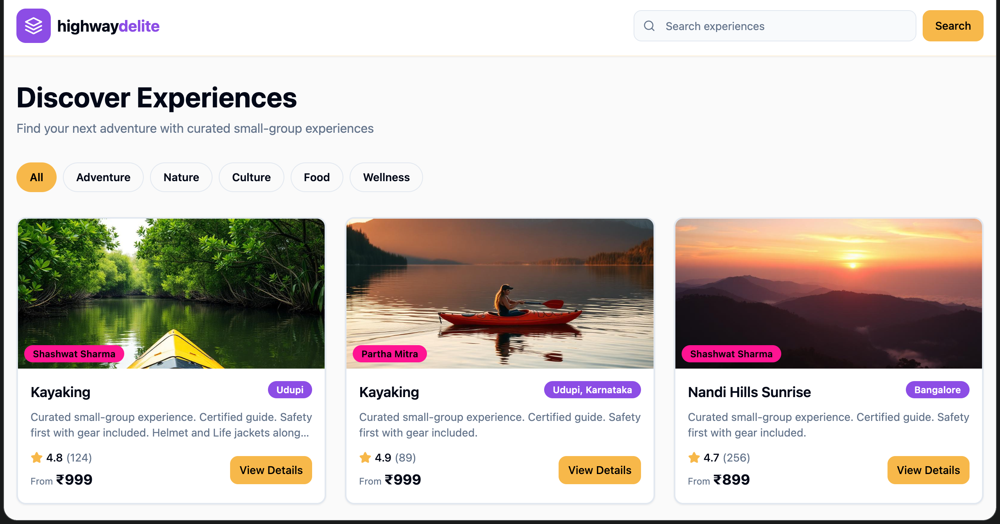

# 🎫 BookIt - Travel Experience Booking Platform

A modern, fullstack web application for discovering and booking unique travel experiences across India. Built with Next.js, TypeScript, and PostgreSQL.



## 🌟 Features

### Core Functionality
- 🔍 **Browse & Search** - Explore diverse travel experiences with advanced filtering
- 📅 **Real-time Availability** - Check live slot availability with seat counts
- 💳 **Seamless Booking** - Complete booking flow with form validation
- 🎟️ **Promo Codes** - Apply discount codes at checkout
- ✉️ **Booking Confirmation** - Instant confirmation with unique booking reference
- 📱 **Fully Responsive** - Optimized for mobile, tablet, and desktop

### User Experience
- ⚡ Fast page loads with Next.js optimization
- 🎨 Pixel-perfect design with modern UI/UX
- 🦴 Skeleton loaders for smooth data fetching
- 🔔 Toast notifications for user feedback
- ♿ Accessible with semantic HTML and ARIA labels
- 🎯 Intuitive navigation with breadcrumbs

### Advanced Features
- 🔒 Prevent double-booking with slot validation
- 💰 Dynamic pricing with automatic calculations (18% GST included)
- 🏷️ Multi-type promo code support (percentage & flat discounts)
- 🖼️ Image optimization with Next.js Image component
- 🔄 Debounced search for better performance
- 📊 Rating and review system
- ⏱️ 15-minute countdown timer on checkout
- 🎉 Confetti animation on successful booking

---

## 🛠️ Tech Stack

### Frontend
- **Framework**: Next.js 14+ (App Router)
- **Language**: TypeScript
- **Styling**: TailwindCSS
- **UI Components**: shadcn/ui with Lucide React icons
- **Forms**: React Hook Form
- **Validation**: Zod
- **Animations**: Framer Motion
- **Notifications**: React Hot Toast

### Backend
- **API**: Next.js API Routes
- **Database**: PostgreSQL (Supabase)
- **ORM**: Prisma
- **Validation**: Zod schemas

### Deployment
- **Hosting**: Vercel
- **Database**: Supabase
- **CDN**: Vercel Edge Network

---

## 📁 Project Structure

```
bookit/
├── src/
│   ├── app/
│   │   ├── page.tsx                          # Home page
│   │   ├── experiences/[id]/page.tsx         # Experience details
│   │   ├── checkout/page.tsx                 # Checkout page
│   │   ├── confirmation/[id]/page.tsx        # Booking confirmation
│   │   ├── layout.tsx                        # Root layout
│   │   ├── api/                              # API Routes
│   │   │   ├── experiences/
│   │   │   │   ├── route.ts                  # GET /api/experiences
│   │   │   │   └── [id]/
│   │   │   │       ├── route.ts              # GET /api/experiences/[id]
│   │   │   │       └── slots/route.ts        # GET /api/experiences/[id]/slots
│   │   │   ├── bookings/
│   │   │   │   ├── route.ts                  # POST /api/bookings
│   │   │   │   └── [reference]/route.ts      # GET /api/bookings/[reference]
│   │   │   └── promo/
│   │   │       └── validate/route.ts         # POST /api/promo/validate
│   │   └── globals.css
│   ├── components/
│   │   ├── ui/                               # shadcn components
│   │   │   ├── button.tsx
│   │   │   ├── input.tsx
│   │   │   ├── card.tsx
│   │   │   ├── badge.tsx
│   │   │   ├── calendar.tsx
│   │   │   └── skeleton.tsx
│   │   ├── ExperienceCard.tsx
│   │   ├── ExperienceGrid.tsx
│   │   ├── FilterSidebar.tsx
│   │   ├── ImageGallery.tsx
│   │   ├── DateTimePicker.tsx
│   │   ├── BookingForm.tsx
│   │   ├── BookingSummary.tsx
│   │   ├── PromoCodeInput.tsx
│   │   └── CountdownTimer.tsx
│   ├── lib/
│   │   ├── supabase.ts                       # Supabase client
│   │   ├── utils.ts                          # Utility functions
│   │   └── validations.ts                    # Zod schemas
│   └── types/
│       └── index.ts                          # TypeScript types
├── .env.local
├── next.config.js
├── tailwind.config.ts
├── tsconfig.json
└── package.json
```

---

## 🚀 Getting Started

### Prerequisites
- Node.js 18+ and npm/yarn/pnpm
- Supabase account (free tier available)
- Git

### Installation

1. **Clone the repository**
```bash
git clone https://github.com/rayAritra/bookit.git
cd bookit
```

2. **Install dependencies**
```bash
npm install
# or
yarn install
# or
pnpm install
```

3. **Set up Supabase**
- Create a new project at [supabase.com](https://supabase.com)
- Go to Project Settings → API
- Copy your project URL and anon key

4. **Set up environment variables**
```bash
cp .env.example .env.local
```

Edit `.env.local`:
```env
# Supabase Configuration
NEXT_PUBLIC_SUPABASE_URL=your_supabase_project_url
NEXT_PUBLIC_SUPABASE_ANON_KEY=your_supabase_anon_key
```

5. **Set up the database**

Run the SQL commands in Supabase SQL Editor (found in the project structure document):
- Create tables for `experiences`, `slots`, `bookings`, `promo_codes`
- Insert seed data for 15 experiences
- Create slots for next 60 days
- Insert promo codes

6. **Start the development server**
```bash
npm run dev
# or
yarn dev
# or
pnpm dev
```

Open [http://localhost:3000](http://localhost:3000) in your browser.

---

## 📊 Database Schema

### Experience
Stores travel experience information with fields for title, description, category, price, rating, location, images, duration, and host details.

### Slot
Manages time slots for each experience. Tracks available and booked seats with unique constraint on experience + date + time combination.

### Booking
Records user bookings with unique booking reference, user details, and payment information.

### PromoCode
Manages discount codes supporting both percentage and flat discounts with active/inactive toggle.

---

## 🔌 API Endpoints

### Experiences

**GET `/api/experiences`**
- Returns list of experiences with pagination
- Query params: `category`, `search`, `minPrice`, `maxPrice`, `page`, `limit`
- Response: `{ experiences: Experience[], total: number, page: number, totalPages: number }`

**GET `/api/experiences/[id]`**
- Returns single experience with full details
- Includes all experience data

**GET `/api/experiences/[id]/slots?date=YYYY-MM-DD`**
- Returns available time slots for specific date
- Shows remaining seats for each slot (MORNING, AFTERNOON, EVENING)

### Bookings

**POST `/api/bookings`**
- Creates a new booking
- Validates slot availability and prevents double-booking
- Generates unique 8-character booking reference
- Body:
```json
{
  "experienceId": "uuid",
  "slotId": "uuid",
  "userName": "string",
  "userEmail": "string",
  "userPhone": "string",
  "guestsCount": number,
  "specialRequests": "string (optional)",
  "promoCode": "string (optional)",
  "basePrice": number,
  "totalPrice": number
}
```

**GET `/api/bookings/[reference]`**
- Returns booking details by reference number
- Includes experience and slot information

### Promo Codes

**POST `/api/promo/validate`**
- Validates promo code and calculates discount
- Body: `{ code: string, bookingAmount: number }`
- Response: `{ valid: boolean, discount: number, message: string }`

**Available Promo Codes:**
- `SAVE10` - 10% discount
- `FLAT100` - ₹100 flat discount
- `FIRST20` - 20% discount

---

## 🎨 Design System

### Colors
```css
Primary: #3B82F6 (Blue)
Success: #10B981 (Emerald)
Error: #EF4444 (Red)
Warning: #F59E0B (Amber)
Background: #F9FAFB (Gray-50)
Card: #FFFFFF (White)
```

### Typography
- Font Family: Inter (system-ui fallback)
- Headings: font-bold
- Body: font-normal
- Uses Tailwind's default text sizes

### Components
- Buttons: rounded-lg with hover effects
- Cards: rounded-xl with shadow-lg
- Inputs: rounded-lg with focus:ring-2
- Badges: rounded-full for categories

### Breakpoints
- Mobile: < 768px
- Tablet: 768px - 1024px
- Desktop: > 1024px

---

## 🧪 Sample Data

The seed data includes 15 diverse travel experiences across India:

1. **Sunrise Himalayan Trek** - Adventure - Manali - ₹4,500 - 4.8★
2. **Jaipur Heritage Food Walk** - Food - Jaipur - ₹1,200 - 4.7★
3. **Kerala Backwater Houseboat** - Nature - Alleppey - ₹8,000 - 4.9★
4. **Goa Scuba Diving** - Water Sports - Goa - ₹3,500 - 4.6★
5. **Varanasi Spiritual Tour** - Spiritual - Varanasi - ₹800 - 4.8★
6. **Mumbai Street Food Safari** - Food - Mumbai - ₹900 - 4.5★
7. **Rajasthan Desert Safari** - Adventure - Jaisalmer - ₹5,500 - 4.7★
8. **Gokarna Yoga Retreat** - Wellness - Gokarna - ₹2,000 - 4.9★
9. **Coorg Coffee Plantation Tour** - Nature - Coorg - ₹1,500 - 4.6★
10. **Mysore Palace Night Tour** - Culture - Mysore - ₹1,000 - 4.8★
11. **Rishikesh River Rafting** - Adventure - Rishikesh - ₹2,500 - 4.7★
12. **Hampi Cycling Adventure** - Culture - Hampi - ₹1,800 - 4.6★
13. **Andaman Snorkeling** - Water Sports - Andaman - ₹4,200 - 4.9★
14. **Udaipur Sunset Lake Cruise** - Nature - Udaipur - ₹1,600 - 4.8★
15. **Delhi Old City Heritage Walk** - Culture - Delhi - ₹700 - 4.5★

Each experience includes:
- 5-6 high-quality images
- 4-5 highlights
- 4-5 inclusions
- Host information
- Slots for next 60 days (3 time slots per day)

---

## 🚢 Deployment

### Deploy to Vercel (Recommended)

1. **Push code to GitHub**
```bash
git add .
git commit -m "Initial commit"
git push origin main
```

2. **Import to Vercel**
- Go to [vercel.com](https://vercel.com)
- Click "New Project"
- Import your GitHub repository
- Configure environment variables
- Deploy!

3. **Environment Variables in Vercel**
Add these in Vercel dashboard:
```
NEXT_PUBLIC_SUPABASE_URL=your_supabase_project_url
NEXT_PUBLIC_SUPABASE_ANON_KEY=your_supabase_anon_key
```

### Build Commands
```bash
# Production build
npm run build

# Start production server
npm start

# Type checking
npm run type-check

# Lint code
npm run lint
```

---

## 📸 Screenshots

### Home Page

*Browse experiences with category filters and search functionality*

### Experience Details

*View details, select dates, time slots, and check real-time availability*

### Checkout

*Complete booking with form validation and promo code application*

### Confirmation

*Booking confirmation with unique reference number and confetti animation*

---

## 🎯 Key Features Implementation

### Slot Management
- Real-time seat availability tracking
- Prevents overbooking with atomic database updates
- Color-coded availability indicators
- Three time slots per day (Morning, Afternoon, Evening)

### Form Validation
- Client-side validation with React Hook Form + Zod
- Server-side validation for security
- Real-time error messages
- Required field indicators
- Phone number auto-formatting

### Promo Code System
- Multiple discount types (percentage/flat)
- Real-time validation feedback
- Automatic price recalculation with GST
- Prevents expired/invalid code usage

### Responsive Design
- Mobile-first approach
- Touch-friendly UI elements
- Sticky booking panel on desktop
- Collapsible filters on mobile

### Performance
- Image optimization with Next.js Image
- Debounced search (300ms)
- Skeleton loaders for better UX
- Server-side rendering for SEO

---

## 🔒 Security Considerations

- Input validation on both client and server
- SQL injection prevention via Supabase
- XSS protection with React
- Environment variables for sensitive data
- CORS configuration
- Atomic transactions for booking creation

---

## 🐛 Troubleshooting

### Database Connection Issues
```bash
# Verify Supabase credentials in .env.local
NEXT_PUBLIC_SUPABASE_URL=https://your-project.supabase.co
NEXT_PUBLIC_SUPABASE_ANON_KEY=your-anon-key
```

### Build Errors
```bash
# Clear cache and reinstall
rm -rf .next node_modules
npm install
npm run build
```

### Type Errors
```bash
# Regenerate TypeScript types
npm run type-check
```

---

## 🚀 Future Enhancements

- [ ] User authentication and profiles
- [ ] Payment gateway integration (Razorpay/Stripe)
- [ ] Email notifications for bookings
- [ ] User reviews and ratings system
- [ ] Wishlist functionality
- [ ] Host dashboard for managing experiences
- [ ] Advanced search with multiple filters
- [ ] Map view of experiences with location
- [ ] Multi-language support (i18n)
- [ ] PWA capabilities for offline access
- [ ] Admin panel for content management
- [ ] Analytics dashboard
- [ ] Social media sharing
- [ ] Chat with host feature
- [ ] Cancellation and refund management
- [ ] Push notifications

---

## 🤝 Contributing

Contributions are welcome! Please follow these steps:

1. Fork the repository
2. Create a feature branch (`git checkout -b feature/AmazingFeature`)
3. Commit your changes (`git commit -m 'Add some AmazingFeature'`)
4. Push to the branch (`git push origin feature/AmazingFeature`)
5. Open a Pull Request

Please ensure your code follows the project's coding standards and includes appropriate tests.

---

## 📄 License

This project is licensed under the MIT License - see the [LICENSE](LICENSE) file for details.

---

## 👨‍💻 Author

**Aritra Ray**
- GitHub: [@rayAritra](https://github.com/rayAritra)
- LinkedIn: [Aritra Ray](https://www.linkedin.com/in/aritra-ray-236681293/)
- Email: aritra.sohan@gmail.com

---

## 🙏 Acknowledgments

- Design inspiration from modern travel booking platforms
- Images from [Unsplash](https://unsplash.com)
- Icons from [Lucide React](https://lucide.dev)
- UI components from [shadcn/ui](https://ui.shadcn.com)
- Built with [Next.js](https://nextjs.org) and [Tailwind CSS](https://tailwindcss.com)
- Database powered by [Supabase](https://supabase.com)

---

## 📞 Support

For support, email aritra.sohan@gmail.com or open an issue in the GitHub repository.

---

## 🌟 Show Your Support

If you found this project helpful, please give it a **⭐ star** on [GitHub](https://github.com/rayAritra/bookit)!

---

**Made with ❤️ by Aritra Ray**